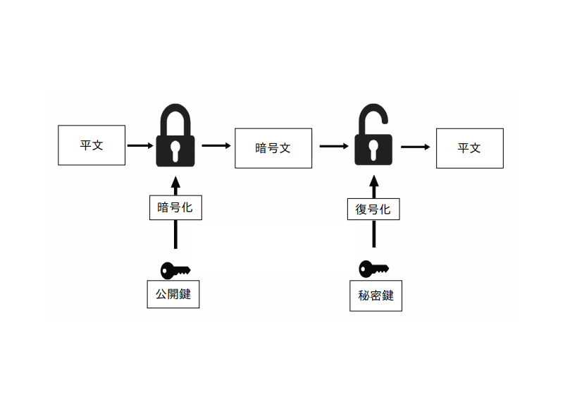

# 簡易RSAアルゴリズムデモ
簡易RSAアルゴリズムデモ	



# 特徴
* スクラッチからRSA公開鍵暗号系をPython3を使用して実装
* 最適化が完全にされていないため鍵生成,暗号化,復号化が既存のライブラリと比較して,著しく遅い
* デモのため,セキュリティは極めて脆弱
* デモのため,ユニットテストが完全ではない
* ハイブリット暗号ではない(つまり,任意の長さを平文は適度な大きさに分割し,各々を暗号化)

### RSAアルゴリズムを使用してファイルを暗号化(/demo/rsa_demo.py)
```python
from rsa_file import encrypt_file,decrypt_file

def main():
    
    # text.txtを暗号化し,その結果をencrypt_text.txtに格納
    # 公開鍵と秘密鍵はそれぞれpub_keys,priv_keysに格納
    encrypt_file("./data/text.txt","./data/encrypt_text.txt","./data/pub_keys","./data/priv_keys")

    # priv_keysに格納されている秘密鍵を使用して,encrypt_text.txtを復号化し,その結果をdecrypt_text.txtに格納
    decrypt_file("./data/encrypt_text.txt","./data/decrypt_text.txt","./data/priv_keys")

if __name__=='__main__':
    main()
    
```